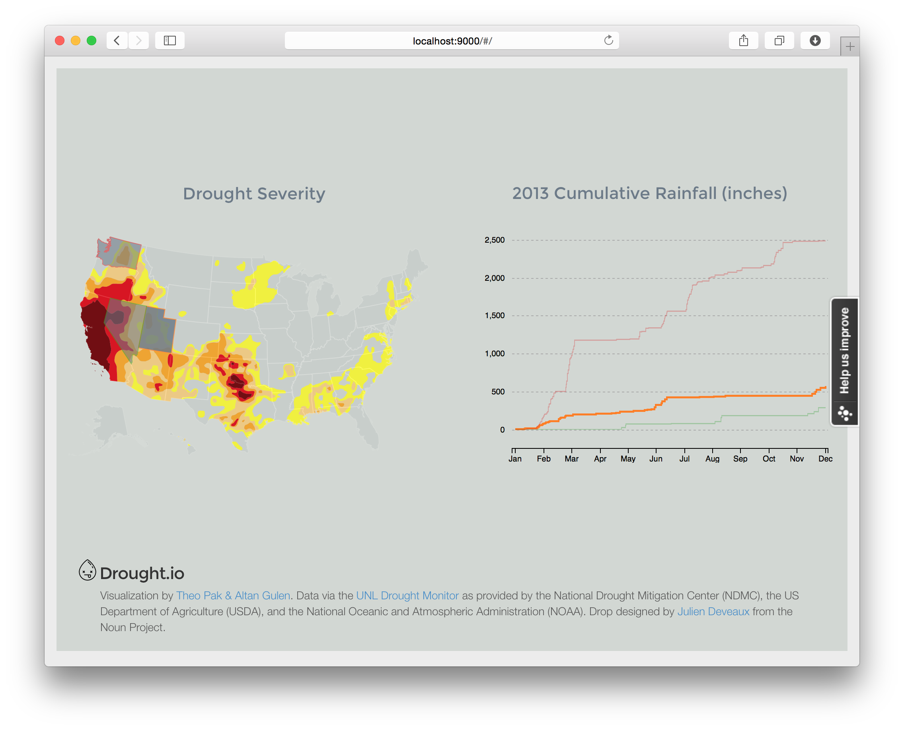

# Drought.io 

[Drought.io](http://www.droght.io) is an interactive visualization of drought in the US, the rainfall patterns that lead to it, and the affect it has on agriculture. It was made by Theo Pak & Altan Gulen.

## Development Notes

- Mapping
  - [_Let’s Make a Map_, by Mike Bostock](http://bost.ocks.org/mike/map/)
  - [_Interactive Map with D3.js](http://www.tnoda.com/blog/2013-12-07)
  - Data Source: http://droughtmonitor.unl.edu/MapsAndData/GISData.aspx
  - Shapefile-to-TopoJSON Conversion Tool: http://www.mapshaper.org
- D3.js charts: [_Let’s Make a Bar Chart, Parts 1-3_, by Mike Bostock](http://bost.ocks.org/mike/bar/)
- Deploying: refer to https://devcenter.heroku.com/articles/getting-started-with-nodejs#prepare-the-app

## References & Inspirations

1. [Prof. Cutler's CSCI-4960 "Interactive Visualization"](http://www.cs.rpi.edu/~cutler/classes/visualization/F14/index.php)
2. http://www.drought.gov
3. http://www.nytimes.com/interactive/2012/08/24/us/drought-crops.html
4. http://www.nytimes.com/interactive/2014/upshot/mapping-the-spread-of-drought-across-the-us.html
5. http://earth.nullschool.net
